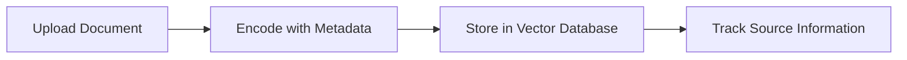
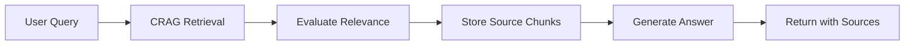
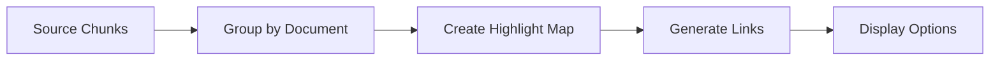

# CRAG Document Viewer Feature - Implementation Guide

## 🎯 Overview

This implementation adds a powerful document viewer feature to your RAG system that allows users to:
- See exactly which text chunks from their documents were used to generate answers
- View original documents with highlighted source text
- Open documents in new tabs or view them embedded in the chat interface
- Navigate directly to the specific passages that contributed to each answer

## 🚀 Features Implemented

### 1. Enhanced CRAG with Source Tracking
- **New Method**: `run_with_sources()` - Returns both answer and detailed source chunk information
- **Source Metadata**: Tracks document path, page numbers, paragraph numbers, and relevance scores
- **Backward Compatibility**: Original `run()` method still works unchanged

### 2. Document Viewer Component (`document_viewer.py`)
- **Text Highlighting**: Automatically highlights relevant text chunks in different colors
- **Multiple View Options**: New tab viewer or embedded expandable sections
- **Download Support**: Users can download original documents
- **Responsive Design**: Works well on different screen sizes

### 3. Enhanced Chatbot Interface
- **Source Links**: Automatic "View Source Document" buttons after CRAG responses
- **Chunk Information**: Shows relevance scores and metadata for each chunk
- **Error Handling**: Graceful fallbacks when documents can't be loaded

## 📁 Files Modified/Created

### New Files:
- `document_viewer.py` - Main document viewer component
- `test_simple_document_viewer.py` - Testing script

### Modified Files:
- `crag.py` - Added source tracking and `run_with_sources()` method
- `chatbot_app.py` - Integrated document viewer UI components
- `requirements.txt` - Added beautifulsoup4 and requests dependencies

## 🔧 Technical Implementation

### CRAG Source Tracking
```python
# In crag.py - stores source chunks during processing
self._last_source_chunks.append({
    'text': doc,
    'source': metadata.get('source', 'Unknown'),
    'page': metadata.get('page'),
    'paragraph': metadata.get('paragraph'),
    'score': score
})
```

### Document Viewer Integration
```python
# In chatbot_app.py - creates document links
if source_chunks:
    # Group chunks by document
    docs_with_chunks = {}
    for chunk in source_chunks:
        doc_path = chunk['source']
        if doc_path not in docs_with_chunks:
            docs_with_chunks[doc_path] = []
        docs_with_chunks[doc_path].append(chunk)
    
    # Create links for each document
    for doc_path, chunks in docs_with_chunks.items():
        create_document_link(doc_path, chunks, "View Document")
```

## 🎮 Usage Instructions

### For Users:
1. **Start the Application**:
   ```bash
   streamlit run chatbot_app.py
   ```

2. **Upload Documents**: Use the file uploader to add PDF, TXT, DOCX, or other supported documents

3. **Ask Questions**: Select "CRAG" as the RAG technique and ask questions

4. **View Sources**: After getting an answer, look for the "📄 Source Documents" section

5. **Explore Documents**: 
   - Click "🔗 New Tab" to open the document in a new window with highlighted text
   - Click "👁️ View Here" to see the document embedded in the chat interface

### For Developers:
1. **Using Enhanced CRAG**:
   ```python
   from crag import CRAG
   
   crag = CRAG(file_path="your_document.pdf")
   result = crag.run_with_sources("Your question")
   
   answer = result['answer']
   source_chunks = result['source_chunks']
   sources = result['sources']
   ```

2. **Creating Document Links**:
   ```python
   from document_viewer import create_document_link
   
   create_document_link(
       document_path="/path/to/document.pdf",
       chunks_to_highlight=source_chunks,
       link_text="View Source"
   )
   ```

## 🎨 UI Features

### Source Document Display
- **Color-coded Chunks**: Each retrieved chunk gets a different highlight color
- **Relevance Scores**: Shows how relevant each chunk was to the query
- **Metadata Display**: Page numbers, paragraph numbers, and source file names
- **Download Options**: Direct download links for original documents

### Responsive Design
- **Scrollable Content**: Large documents fit in scrollable containers
- **Sidebar Navigation**: Quick access to chunk information
- **Mobile Friendly**: Works on different screen sizes

## 🔍 How It Works

### 1. Document Processing


### 2. Query Processing


### 3. Document Viewing


## ⚙️ Configuration

### Environment Variables
```bash
# In .env file
CRAG_WEB_SEARCH=true          # Enable/disable web search
CRAG_FALLBACK_MODE=true       # Enable fallback to best available chunk
GOOGLE_API_KEY=your_key_here  # Required for CRAG functionality
```

### Customization Options
- **Highlight Colors**: Modify HSL color generation in `highlight_text_in_document()`
- **Relevance Thresholds**: Adjust `lower_threshold` and `upper_threshold` in CRAG
- **Chunk Display**: Customize chunk information display in document viewer

## 🛠️ Dependencies

### New Requirements:
```txt
beautifulsoup4  # For web search HTML parsing
requests        # For web search functionality
```

### Existing Requirements:
- streamlit
- langchain
- langchain-google-genai
- faiss-cpu
- python-dotenv

## 🧪 Testing

Run the test suite to verify everything works:
```bash
python test_simple_document_viewer.py
```

Expected output:
```
✅ document_viewer.py syntax is valid
✅ crag.py syntax is valid  
✅ chatbot_app.py syntax is valid
✅ Document viewer imports successful
✅ CRAG.run_with_sources method exists
✅ CRAG source tracking attributes found
```

## 🚨 Troubleshooting

### Common Issues:

1. **Import Errors**:
   - Make sure all dependencies are installed: `pip install -r requirements.txt`
   - Check that `document_augmentation.py` exists and has `load_document_content()`

2. **API Errors**:
   - Verify `GOOGLE_API_KEY` is set in `.env` file
   - Check internet connection for web search functionality

3. **Document Not Found**:
   - Ensure uploaded documents are in accessible locations
   - Check file permissions

4. **Highlighting Not Working**:
   - Verify document content can be loaded as text
   - Check that chunk text matches document content exactly

## 🎯 Benefits

### For Users:
- **Transparency**: See exactly where answers come from
- **Verification**: Easily verify information against source documents
- **Context**: Understand the context around retrieved information
- **Navigation**: Quick access to full document content

### For Developers:
- **Debugging**: Easy to see what chunks are being retrieved
- **Evaluation**: Better understanding of retrieval quality
- **Customization**: Extensible framework for document viewing
- **Integration**: Clean separation of concerns with modular design

## 🔮 Future Enhancements

Potential improvements for the document viewer:
- **PDF Annotation**: Direct PDF viewing with annotations
- **Search Within Document**: In-document search functionality
- **Chunk Relationships**: Show relationships between chunks
- **Export Features**: Export highlighted sections
- **Multi-language Support**: Support for different document languages

## 📝 Example Usage

Here's a complete example of how the enhanced CRAG works:

```python
# 1. Initialize CRAG with document
crag = CRAG("data/climate_report.pdf")

# 2. Ask a question and get sources
result = crag.run_with_sources("What causes climate change?")

# 3. Access the results
print("Answer:", result['answer'])
print("Source chunks:", len(result['source_chunks']))

# 4. Show document viewer (in Streamlit)
for doc_path, chunks in group_chunks_by_document(result['source_chunks']):
    create_document_link(doc_path, chunks, "View Climate Report")
```

This implementation provides a complete, user-friendly solution for document-aware RAG systems with full traceability and source verification capabilities.
